<div id="top"></div>

<!-- PROJECT LOGO -->
<br />
<div align="center">
  <a href="https://github.com/NgoQuocBao1010/PHP-Spotify-Clone">
    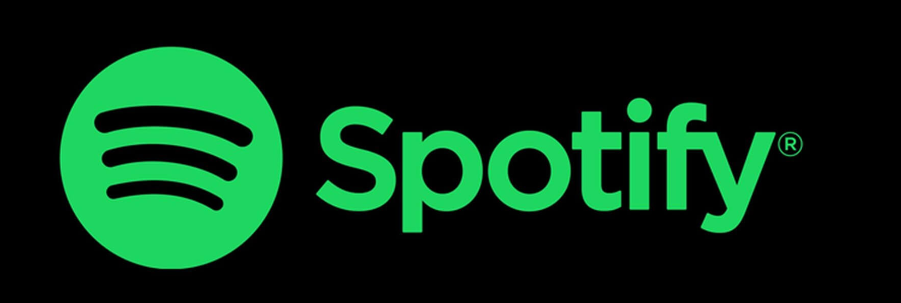
  </a>

  <h3 align="center"> <strong>Spotify Clone</strong> </h3>

  <p align="center">
    A music player application was built with PHP, MySQL, Vanila Javascript, HTML and CSS.
    <br />
    <br />
</p>
</div>

<!-- ABOUT THE PROJECT -->

## About The Project
This project is a university project I built with my partner Đặng Nguyễn Phú Nguyên. The goal of this project is to build a website that mimic the appearances and also some of the basic funtionalities of a popular music-streaming platform - Spotify.

<p align="center">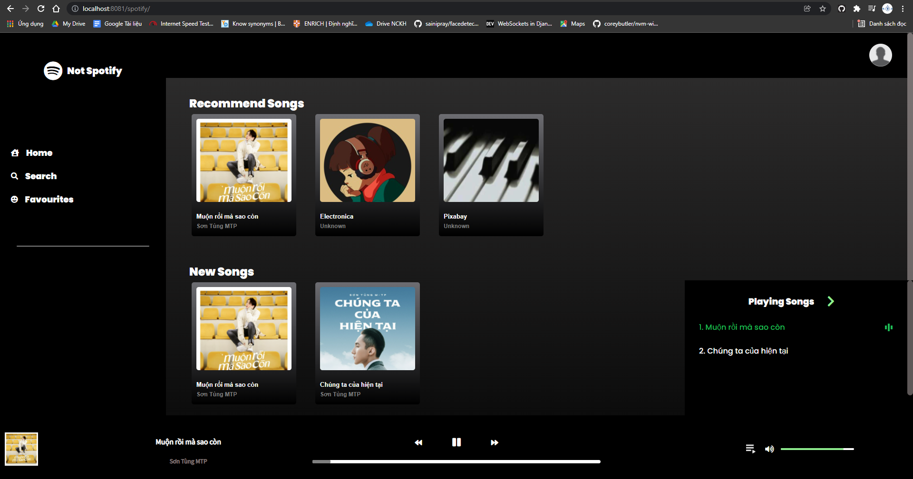</p>

Here's what the web can do:

- Full functional music player (play/stop, fast forward, volume control).
- Music playing queue.
- Manage favourite songs.
- Searching for songs by titles or singer names.
- Basic C.R.U.D operations for Administrator.


<p><i>Go <a href="#screenshots">here</a> for more screenshots of the website</i></p> 

<p align="right">(<a href="#top">back to top</a>)</p>

### Built With

- [PHP](https://www.php.net/)
- [Javascript](https://www.javascript.com/)
- [MySQL](https://www.mysql.com/)

<p align="right">(<a href="#top">back to top</a>)</p>

<!-- GETTING STARTED -->
## Getting Started

You can run docker to take a peek at our project. Before starting, please make sure you have **Docker** install on your machine.

### Installation

1. Clone the repo
   ```sh
   git clone https://github.com/NgoQuocBao1010/PHP-Spotify-Clone.git
   ```
2. Change directory to the docker folder
   ```sh
   cd docker
   ```
3. Build the docker container
   ```sh
   docker-compose up
   ```
4. Now, the installation part is done:
   
   - Go to the [localhost:8000](http://localhost:8000/) on your computer to use our **main website**.
   - Go to the [localhost:8080](http://localhost:8080/) on your computer to view our **phpAdmin** of the project.


<p align="right">(<a href="#top">back to top</a>)</p>


<!-- SCREENSHOTS -->
<div id="screenshots"></div>

## Screenshots of the website

1. <details>
      <summary>Main Website</summary>
      <ul>
      <br/>
      <li><p align="center"></p></li>
      <br/>
      <li><p align="center">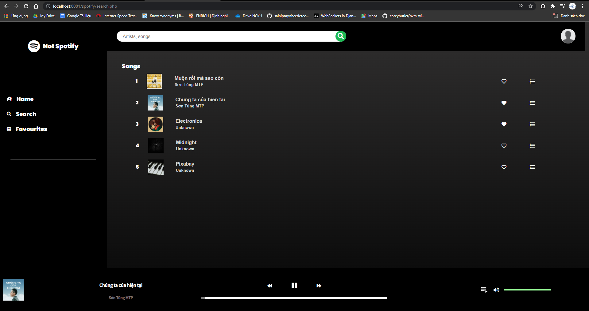</p></li>
      <br/>
      <li><p align="center">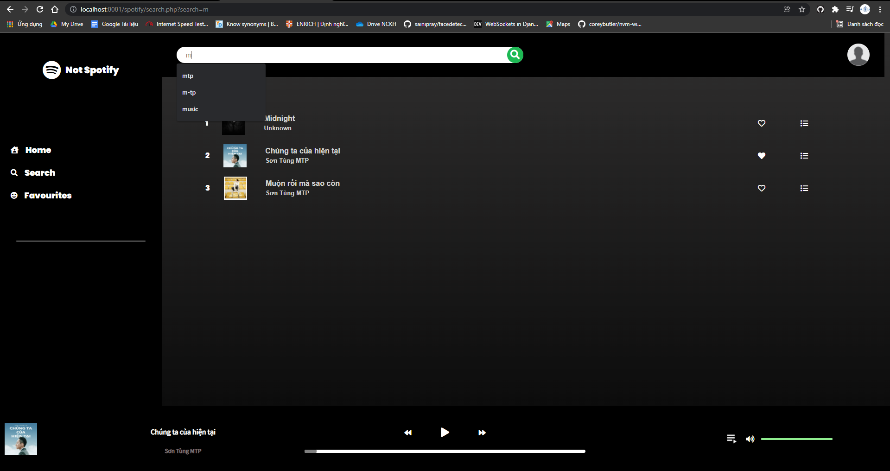</p></li>
      <br/>
      <li><p align="center">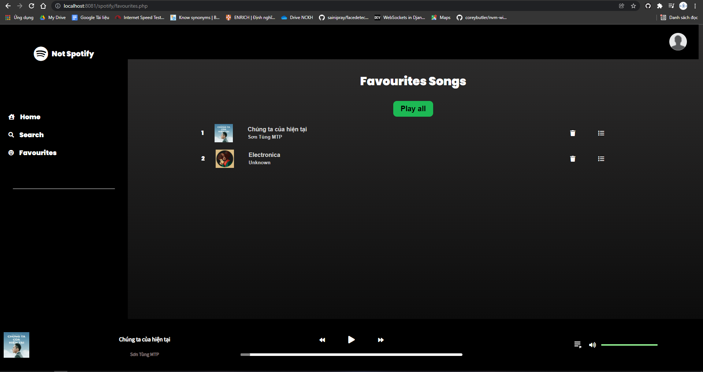</p></li>
      <br/>
      <li><p align="center">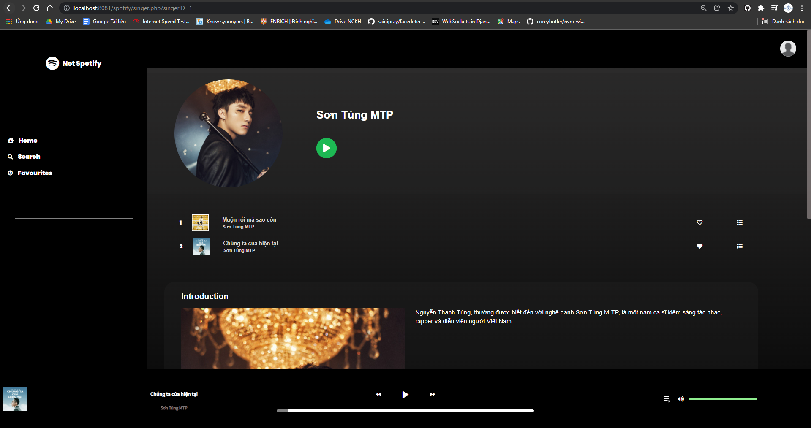</p></li>
      </ul>
   </details>

<br/>

2. <details>
      <summary>Administrator Website</summary>
      <ul>
      <br/>
      <li><p align="center">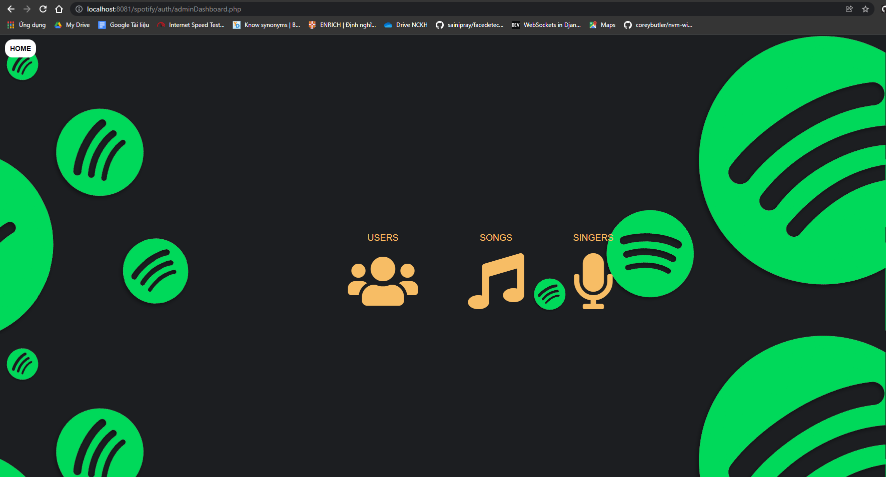</p></li>
      <br/>
      <li><p align="center">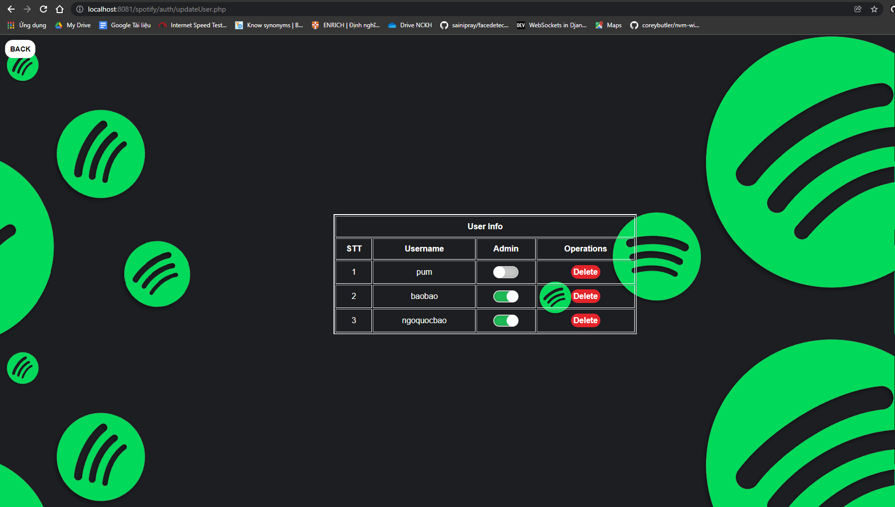</p></li>
      <br/>
      <li><p align="center">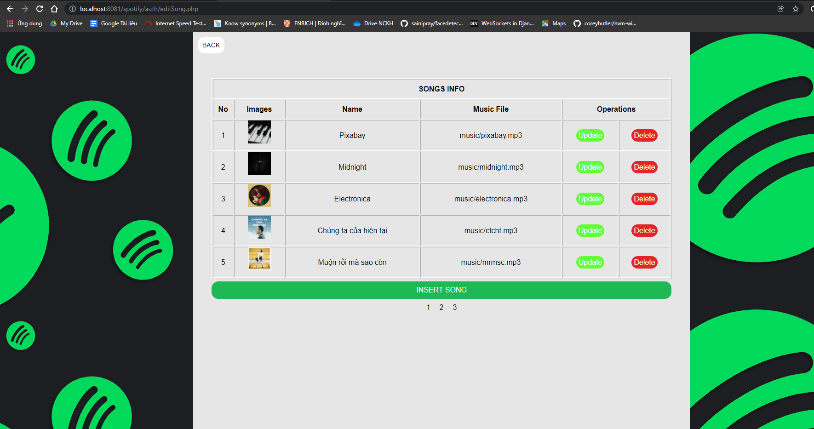</p></li>
      <br/>
      <li><p align="center">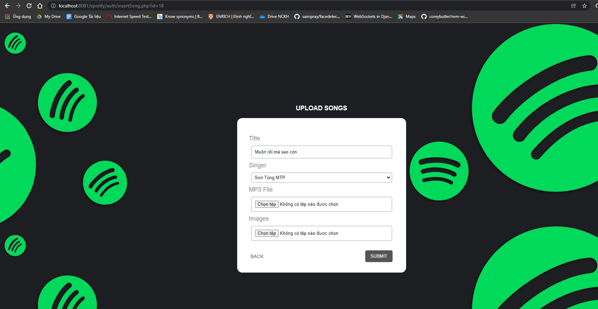</p></li>
      <br/>
      <li><p align="center">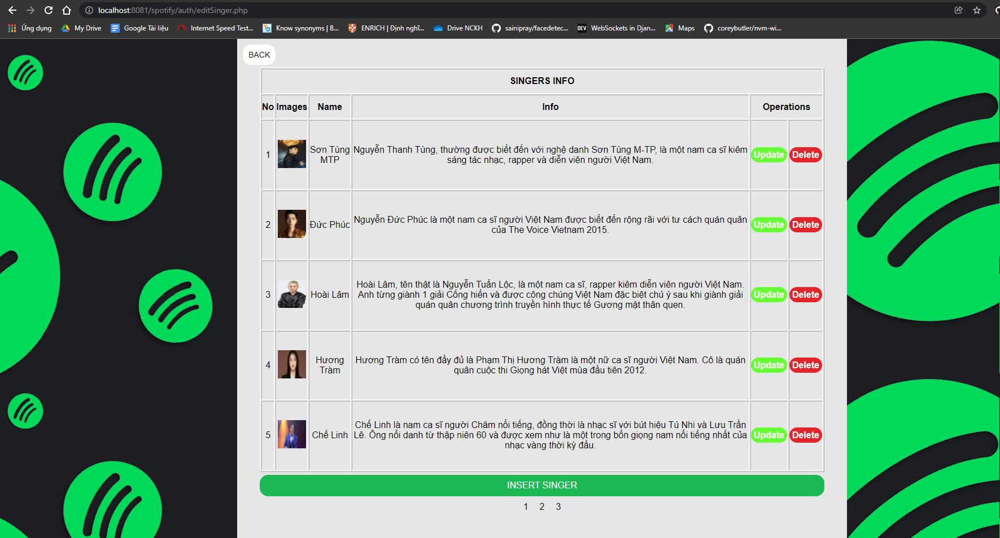</p></li>
      <br/>
      </ul>
   </details>

<br/>

*For more details on the project, please refer to our [full powerpoint report (Vietnamese)](docs/project_reports.pptx).*

<p align="right">(<a href="#top">back to top</a>)</p>

<br/>
<br/>

<!-- CONTRIBUTING -->
## Contributing

Contributions are what make the open source community such an amazing place to learn, inspire, and create. Any contributions you make are **greatly appreciated**.

If you have a suggestion that would make this better, please fork the repo and create a pull request.
Don't forget to give the project a star ⭐⭐⭐! Thanks again!

1. Fork the Project
2. Create your Feature Branch (`git checkout -b feature/AmazingFeature`)
3. Commit your Changes (`git commit -m 'Add some AmazingFeature'`)
4. Push to the Branch (`git push origin feature/AmazingFeature`)
5. Open a Pull Request

<p align="right">(<a href="#top">back to top</a>)</p>

<!-- LICENSE -->

## License

Distributed under the MIT License.

<p align="right">(<a href="#top">back to top</a>)</p>

<!-- CONTACT -->

## Contact Us

Ngô Hồng Quốc Bảo - [@NgoQuocBao](https://twitter.com/ngohquocbao1010)

Đặng Nguyễn Phú Nguyên - [@nguyendang127](https://github.com/nguyendang127)

Project Link: [https://github.com/NgoQuocBao1010/PHP-Spotify-Clone](https://github.com/NgoQuocBao1010/PHP-Spotify-Clone)

<p align="right">(<a href="#top">back to top</a>)</p>

<!-- ACKNOWLEDGMENTS -->

## Acknowledgments

This awesome README temaplate is from [Best README Template](https://github.com/othneildrew/Best-README-Template). ♥

<p align="right">(<a href="#top">back to top</a>)</p>
